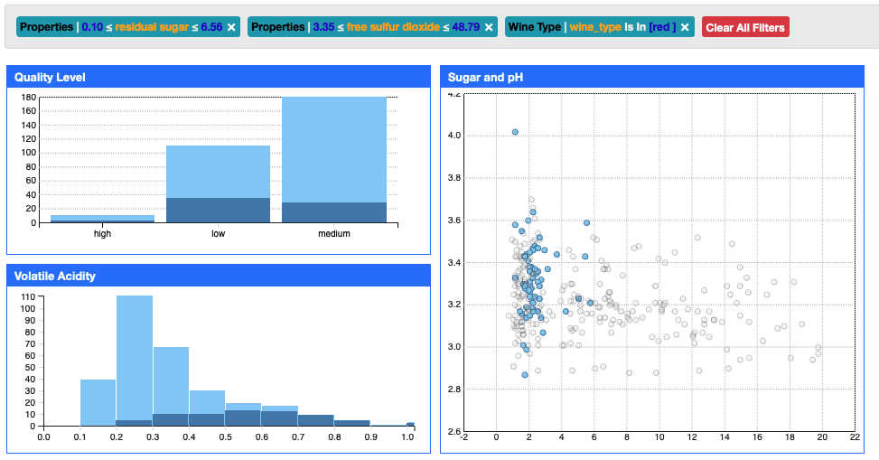

# Summary

Eaglescope is a configurable code-free interactive visualization and cohort selection tool designed for biomedical data exploration. It is designed to be hosted flexibly without the need for a dedicated server, and creates an interactive dashboard based upon a configuration file and either an API or data file. It uses visualizations of sets of features to describe and enable contextual filtering of the data. This allows for users to understand deeper patterns or anomalies within the data, and to create datasets specifically tuned to their requirements effortlessly.
Eaglescope is typically utilized either as a tool to create refined datasets tailored for training and validating machine learning AI models, or as a central hub for further exploration, allowing users to seamlessly navigate to biomedical viewers such as DICOM or whole slide imaging (WSI) platforms.

To create a dashboard, users simply need to create a file specifying the data source, configurations for each visualization, and any further desired customizations to the platform. Hosting is as straightforward as copying the static files, along with the configuration and data files if applicable, to any location capable of hosting static files. This streamlined process was intentionally designed to support the visualization of multiple datasets without added complexity or specialized requirements. Additionally, the flexibility of hosting allows for seamless scalability with demand, eliminating the need for modifications to Eaglescope itself.

# Statement of Need

Eaglescope was initially developed as a successor to abother tool [@datascope2017] to enhance the usability of interactively exploring tabular biomedical datasets with a focus on cohort analysis. To achieve this, we created a versatile tool capable of supporting multiple datasets, easily reconfigurable without coding, and deployable in a serverless manner. Moreover, Eaglescope facilitates hierarchical usage, allowing dashboards to represent and link to other dashboards. Recognizing the value of visually contextualized filtering operations, we introduced a set of visualizations that display filtered data within its broader context. This approach enables users to uncover patterns in the data that might otherwise go unnoticed, fostering deeper insights and more informed decision making in biomedical research.
Eaglescope takes inspiration from Bokeh [@bokeh], cBioPortal [@cbioportal2013], and NBIA [@nbia2020] for features and user experience.
The Cancer Imaging Archive (TCIA) [@tica2013] and the National Cancer Institute use Eaglescope to enable exploration and export of the large amount of data across collections and modalities and the PRISM [@prism2020] project includes Eaglescope to facilitate dataset creation and visualization.

# Acknowledgements

We acknowledge all contibutors to the Eaglescope project, as well as grant support subawarded by the University of Arkansas Medical School and both financial and logistical support from the Emory Univeristy Department of Biomedical Informatics.

# References

